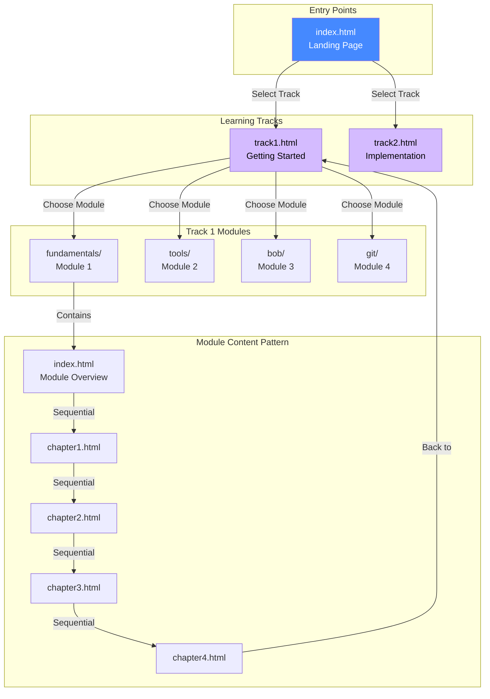
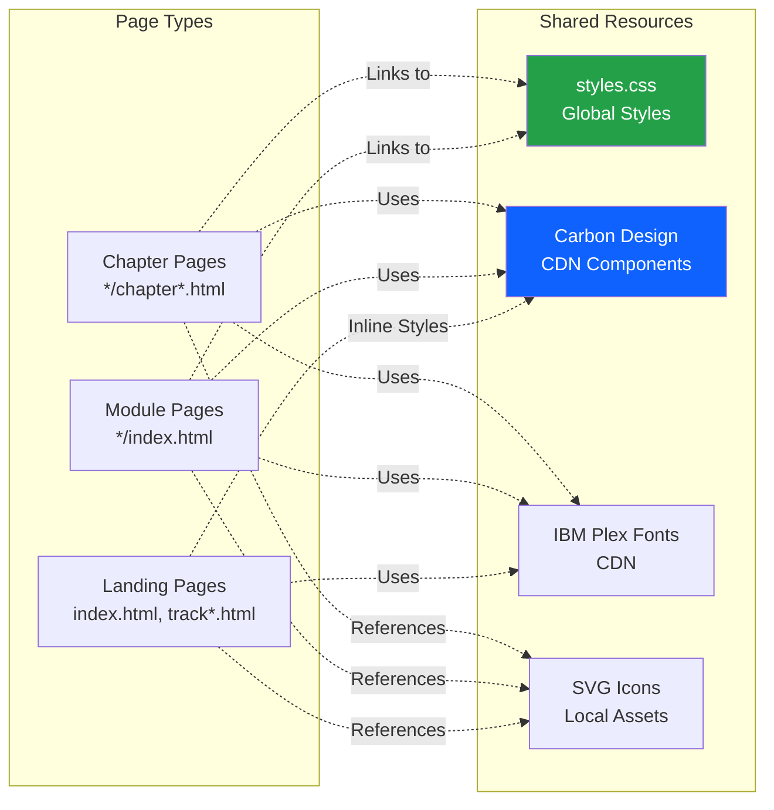

# Modern DevOps for IBM i - Architecture Documentation

This document explains the file hierarchy, interactions, and workflows for working with the modern-devops-ibm-i repository.

## Repository Overview

This is a static website built with HTML, CSS, and IBM Carbon Design System components. It provides a structured learning path for IBM i DevOps practices.

## File Hierarchy

```
modern-devops-ibm-i/
├── index.html              # Landing page with track overview
├── track1.html             # Track 1: Getting Started overview
├── track2.html             # Track 2: Implementation overview
├── styles.css              # Shared CSS styles for all module pages
├── *.svg                   # Icon assets used throughout the site
│
├── fundamentals/           # Module 1: DevOps Fundamentals
│   ├── index.html         # Module landing page
│   ├── chapter1.html      # DevOps 101
│   ├── chapter2.html      # Traditional vs Modern workflows
│   ├── chapter3.html      # IBM i architecture essentials
│   ├── chapter4.html      # Adopting DevOps culture
│   └── *.svg              # Module-specific icons
│
├── tools/                  # Module 2: DevOps Tools
│   ├── index.html         # Module landing page
│   ├── chapter1-4.html    # Topic chapters
│   └── *.svg              # Module-specific icons
│
├── bob/                    # Module 3: IBM Bob for i
│   ├── index.html         # Module landing page
│   ├── chapter1-4.html    # Topic chapters
│   └── (no SVGs yet)
│
└── git/                    # Module 4: Version Control with Git
    ├── index.html         # Module landing page
    ├── chapter1-4.html    # Topic chapters
    └── (no SVGs yet)
```

## Architecture Diagram

### Site Navigation Flow



### Component Dependencies



## File Interactions

### 1. Landing Page (index.html)
- **Purpose**: Main entry point showcasing learning tracks
- **Links to**: 
  - `track1.html` (Getting Started)
  - `track2.html` (Implementation)
- **Uses**: Inline CSS, Carbon components, SVG icons
- **Key sections**: Hero, Why DevOps, Learning Tracks

### 2. Track Overview Pages (track1.html, track2.html)
- **Purpose**: Display modules within each learning track
- **Links to**: Module landing pages (e.g., `fundamentals/index.html`)
- **Links from**: `index.html`
- **Uses**: Inline CSS, Carbon components, breadcrumb navigation
- **Key sections**: Hero, Module cards with descriptions

### 3. Module Landing Pages (*/index.html)
- **Purpose**: Introduce module topics and provide navigation
- **Links to**: Chapter pages within the module
- **Links from**: Track overview pages
- **Uses**: `../styles.css`, Carbon components, sidebar navigation
- **Key sections**: Breadcrumb, sidebar nav, main content, page navigation

### 4. Chapter Pages (*/chapter*.html)
- **Purpose**: Detailed content for specific topics
- **Links to**: Next/previous chapters, back to track overview
- **Links from**: Module landing page or previous chapter
- **Uses**: `../styles.css`, Carbon components, sidebar navigation
- **Key sections**: Breadcrumb, sidebar nav, article content, page navigation

## CSS Architecture

### Shared Styles (styles.css)
Located at root level, provides consistent styling for all module and chapter pages:

- **Layout**: Sidebar navigation, main content area, optional right sidebar
- **Typography**: IBM Plex Sans font, heading hierarchy
- **Components**: Breadcrumbs, navigation links, info boxes, code blocks
- **Responsive**: Breakpoints for mobile, tablet, desktop

### Inline Styles
Landing and track pages use inline `<style>` tags for page-specific styling:
- Hero sections with gradients
- Custom grid layouts
- Path cards and tiles
- Progress indicators (commented out in track pages)

## Navigation Patterns

### Breadcrumb Navigation
All pages include breadcrumbs showing the path:
```
Home / Track / Module / Chapter
```

Example: `Home / Getting started / DevOps fundamentals / DevOps 101`

### Sidebar Navigation
Module and chapter pages include a left sidebar with:
- Module title and number
- List of all topics/chapters
- Additional resources section

### Page Navigation
Bottom of each page includes:
- "← Back" link (to parent page)
- "Next: [Topic] →" link (to next chapter)

### Home Icon
All pages can return to `index.html` via the home icon in breadcrumbs

## Working with Files

### Adding a New Module

1. **Create module directory**: `mkdir new-module/`
2. **Copy template structure** from existing module (e.g., `fundamentals/`)
3. **Update module landing page** (`new-module/index.html`):
   - Change sidebar title and subtitle
   - Update breadcrumb path
   - Add topic descriptions
   - Update navigation links
4. **Create chapter files** (`chapter1.html`, `chapter2.html`, etc.)
5. **Update track overview** (`track1.html` or `track2.html`):
   - Add new module card with link to `new-module/index.html`
6. **Add SVG icons** if needed to module directory

### Adding a New Chapter

1. **Copy existing chapter** as template
2. **Update content**:
   - Change `<title>` tag
   - Update breadcrumb path
   - Replace article content
   - Update sidebar navigation to mark chapter as active
3. **Update navigation links**:
   - Previous chapter's "Next" link
   - New chapter's "Back" and "Next" links
   - Module landing page links
4. **Add to sidebar** in all module pages

### Editing Existing Content

1. **Locate the file** using the hierarchy above
2. **Edit content** within the `<article>` section
3. **Maintain structure**:
   - Keep breadcrumb navigation
   - Keep sidebar navigation
   - Keep page navigation at bottom
4. **Test links** to ensure navigation still works

### Styling Guidelines

**For module/chapter pages:**
- Use `styles.css` for all styling
- Reference as `../styles.css` from module directories
- Add custom styles to `styles.css` if needed

**For landing/track pages:**
- Use inline `<style>` tags
- Follow Carbon Design System patterns
- Maintain consistent color scheme (blues, purples)

## Key Design Patterns

### Carbon Design System
- Uses Carbon Components CSS from CDN
- Follows Carbon grid system (`bx--grid`, `bx--row`, `bx--col-lg-16`)
- Uses Carbon typography classes (`bx--type-*`)
- Uses Carbon UI components (`bx--tile`, `bx--tag`, `bx--btn`)

### IBM Plex Fonts
- IBM Plex Sans for body text
- IBM Plex Mono for code
- Loaded from Google Fonts CDN

### Color Scheme
- Primary blue: `#0f62fe` / `#4589ff`
- Purple accent: `#d4bbff`
- Success green: `#24a148`
- Neutral grays: `#161616`, `#525252`, `#e0e0e0`, `#f4f4f4`

### Responsive Breakpoints
- Desktop: > 1056px (full sidebar)
- Tablet: 672px - 1056px (hidden sidebar)
- Mobile: < 672px (stacked layout)

## Content Guidelines

### Info Boxes
Use for key insights or important notes:
```html
<div class="info-box">
    <div class="info-box-title">Key Insight</div>
    <p>Your important message here.</p>
</div>
```

### Warning Boxes
Use for cautions or warnings:
```html
<div class="warning-box">
    <div class="warning-box-title">Important</div>
    <p>Your warning message here.</p>
</div>
```

### Code Blocks
Inline code: `<code>command</code>`

Code blocks:
```html
<pre><code>
Your code here
</code></pre>
```

### Lists
Lists automatically get checkmark icons via CSS:
```html
<ul>
    <li>First item</li>
    <li>Second item</li>
</ul>
```

## Development Workflow

### Local Development
1. Clone repository
2. Open `index.html` in browser (no build process needed)
3. Edit HTML/CSS files directly
4. Refresh browser to see changes

### File Organization
- Keep related files in module directories
- Use relative paths for links (`../` to go up one level)
- Store shared assets at root level
- Store module-specific assets in module directories

### Testing Checklist
- [ ] All navigation links work
- [ ] Breadcrumbs show correct path
- [ ] Sidebar navigation highlights active page
- [ ] Page navigation (back/next) works
- [ ] Responsive layout works on mobile
- [ ] Images/icons load correctly
- [ ] CSS styles apply correctly

## Future Enhancements

Based on the current structure, potential improvements include:

1. **Progress Tracking**: Uncomment and implement progress bars in track pages
2. **Search Functionality**: Add search across all content
3. **Right Sidebar**: Implement "On this page" navigation for long chapters
4. **Lab Exercises**: Add interactive exercises (currently commented out)
5. **Track 2 Content**: Complete implementation track modules
6. **Additional Resources**: Populate external resource links

## Quick Reference

### Common File Paths
- Home: `index.html`
- Track 1: `track1.html`
- Module 1: `fundamentals/index.html`
- Module 1, Chapter 1: `fundamentals/chapter1.html`
- Shared styles: `styles.css`

### Common Link Patterns
- From chapter to track: `../track1.html`
- From chapter to module index: `index.html`
- From module to track: `../track1.html`
- From track to home: `index.html`
- From chapter to styles: `../styles.css`

### SVG Icon Usage
```html

