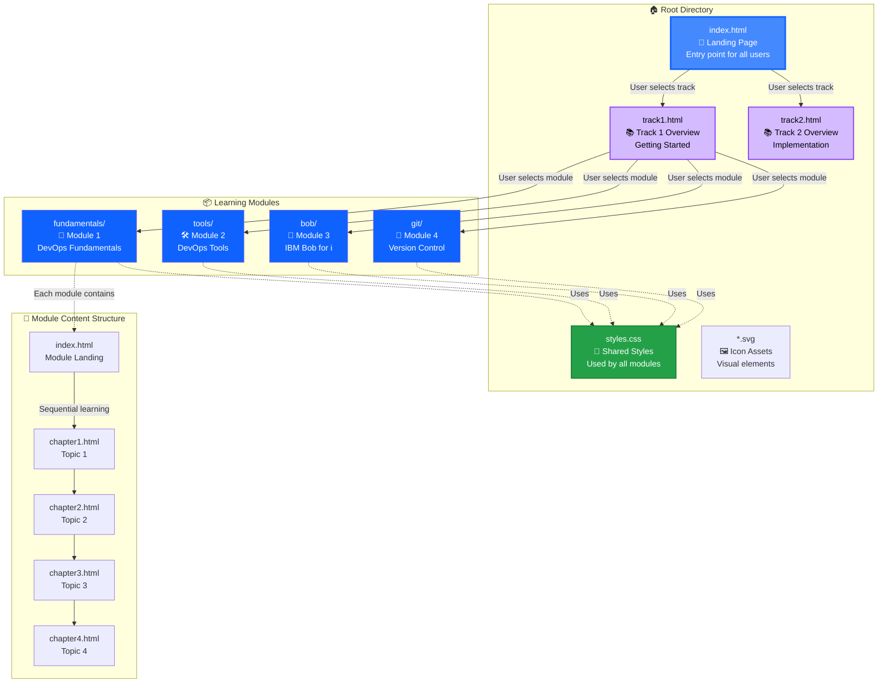
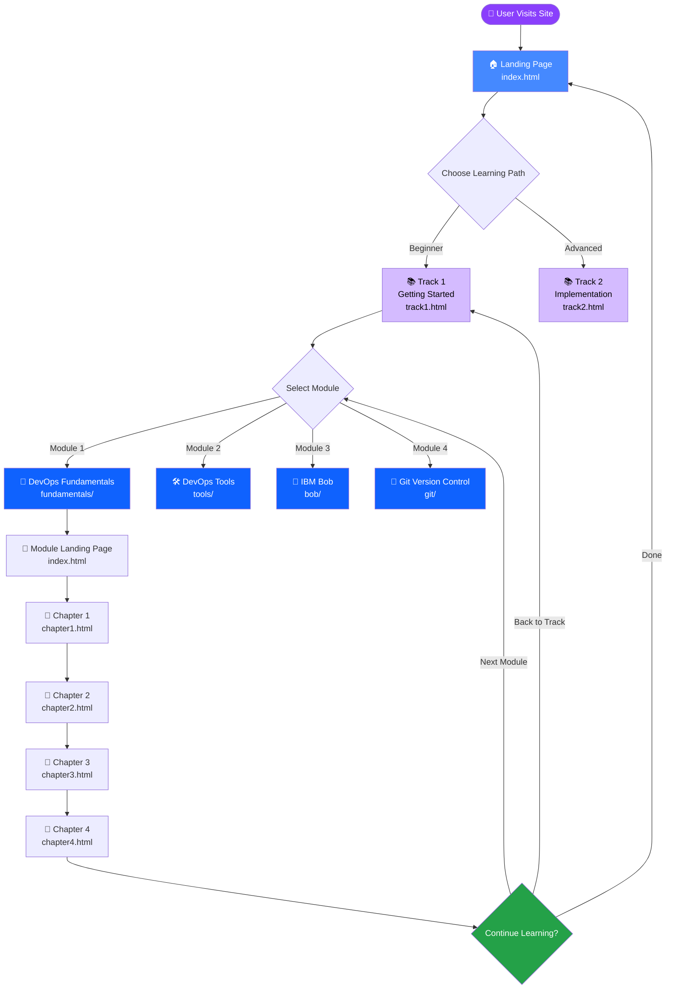
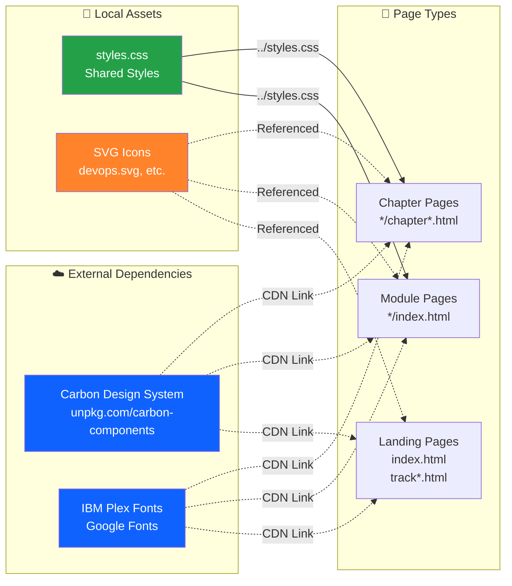
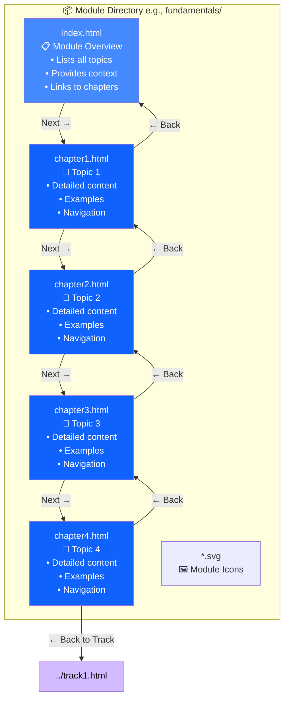
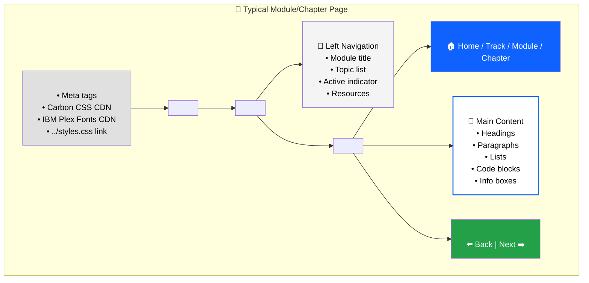
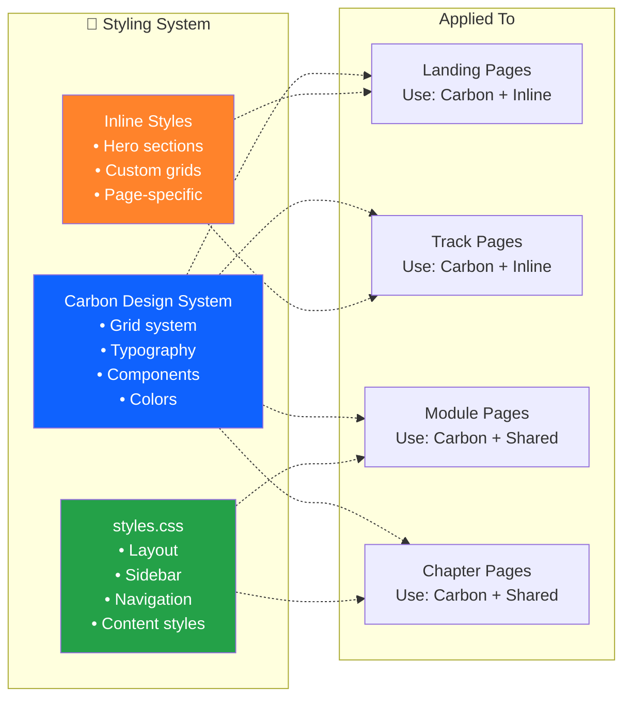
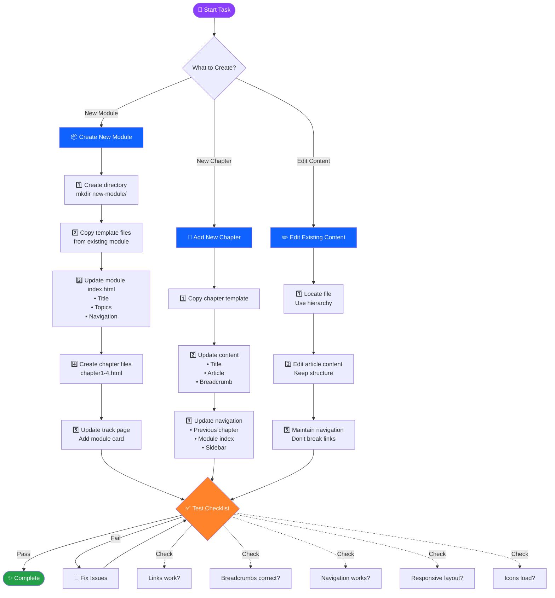
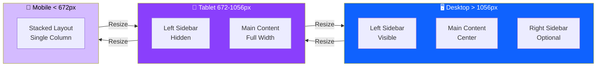

# Modern DevOps for IBM i - Visual Architecture Guide

This document provides visual diagrams to help you understand and explain the repository structure and file interactions.

## 1. Complete Site Architecture



## 2. User Navigation Flow



## 3. File Dependency Map



## 4. Module Content Pattern

Each module follows this consistent structure:



## 5. Page Component Structure



## 6. Styling Architecture



## 7. Content Contributor Workflow



## 8. Quick Reference: Common Paths

### From Root Level
```
index.html                    → Landing page
track1.html                   → Track 1 overview
track2.html                   → Track 2 overview
styles.css                    → Shared styles
fundamentals/index.html       → Module 1 landing
```

### From Module Level (e.g., fundamentals/)
```
index.html                    → Module landing
chapter1.html                 → First topic
../track1.html                → Back to track
../styles.css                 → Shared styles
../devops.svg                 → Root-level icon
```

### From Chapter Level (e.g., fundamentals/chapter1.html)
```
index.html                    → Module landing
chapter2.html                 → Next chapter
../track1.html                → Back to track
../styles.css                 → Shared styles
../index.html                 → Site home
```

## 9. Responsive Behavior



## Legend

| Icon | Meaning |
|------|---------|
| 🏠 | Home/Landing page |
| 📚 | Learning track |
| 📦 | Module directory |
| 📖 | Module content |
| 📝 | Chapter/Topic |
| 🎨 | Styling/CSS |
| 🖼️ | Images/Icons |
| ☁️ | External/CDN |
| 💾 | Local files |
| 🔀 | Version control |
| 🛠️ | Tools |
| 🤖 | AI/Bob |
| ⬅️➡️ | Navigation |
| ✅ | Testing/Complete |

## Color Coding

- **Blue (#4589ff, #0f62fe)**: Primary pages and navigation
- **Purple (#d4bbff, #8a3ffc)**: Learning tracks
- **Green (#24a148)**: Shared resources and completion
- **Orange (#ff832b)**: Warnings and special attention
- **Gray (#f4f4f4, #e0e0e0)**: Neutral elements

---

**Use these diagrams to:**
- Explain the site structure to new contributors
- Plan new content additions
- Understand file relationships
- Debug navigation issues
- Present the architecture to stakeholders